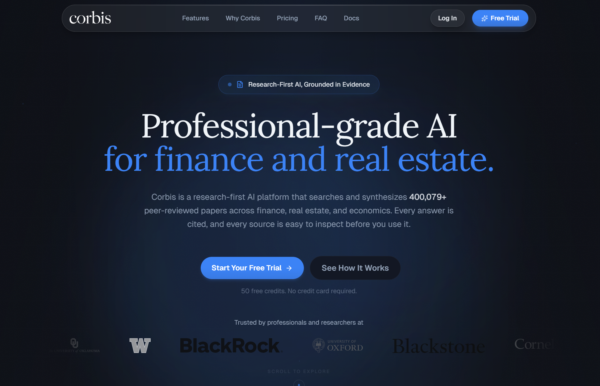
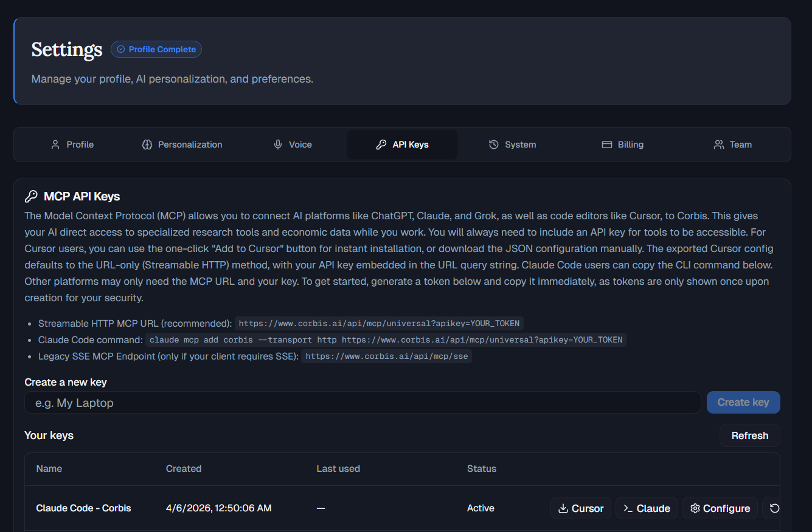
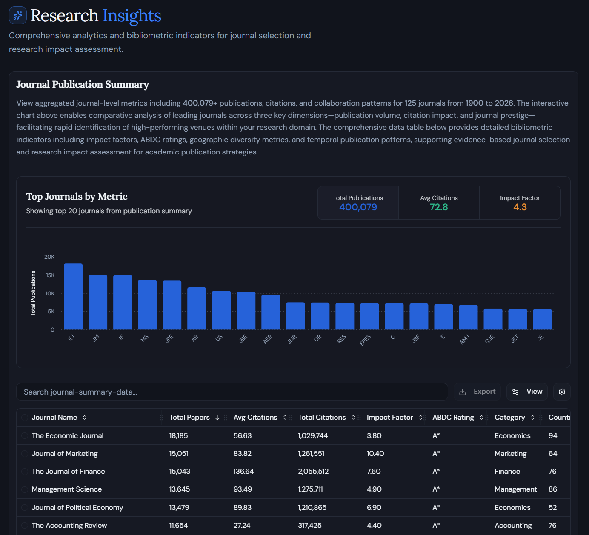
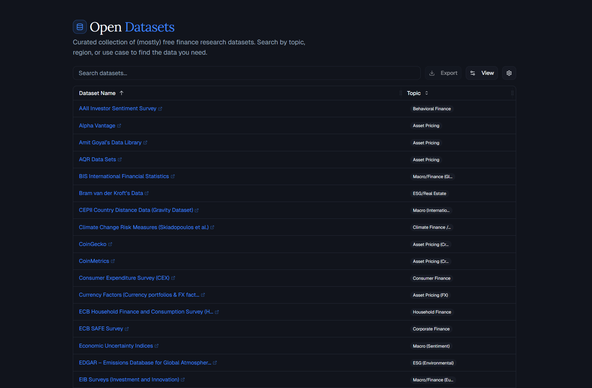

<div align="center">

# Corbis Literature Starter Kit 

**Turn your AI assistant into a literature-review machine. Search 400,000+ papers,  
map a field, test ideas, and come back with citations instead of 37 half-read browser tabs.**

[](LICENSE)
[](https://www.corbis.ai)
[](./CORBIS_MCP_CODEX_GUIDE.md)
[](https://docs.anthropic.com/en/docs/claude-code)
[](https://cursor.sh)

[corbis.ai](https://www.corbis.ai/) | [Quick Setup](#quick-setup) | [Workflows](#the-workbench) | [Documentation](#documentation) | [Get a Corbis Key](https://www.corbis.ai) | [Corbis Research Database](#research-insights) | [Open Datasets](#open-datasets)

[](https://www.corbis.ai/)

</div>

---

## What is Corbis ([corbis.ai](https://www.corbis.ai/))

[Corbis](https://www.corbis.ai/) is **research-first AI** for finance, real estate, and economics. You ask in plain language; it **searches a large, domain-specific index** (hundreds of thousands of peer-reviewed papers, plus industry reports and market data in the product) and returns **answers with citations** you can open and check. The goal is evidence you can stand behind, not unattributed claims. For a journal-level snapshot of publications and what the corpus includes, see [Research Insights](https://www.corbis.ai/insights).

The full platform adds chat, guided workflows, and exports (for example PDF, Word, LaTeX, and citation formats). **MCP** (Model Context Protocol) exposes the same underlying tools to external clients (Cursor, Claude Code, Codex, and other compatible agents). **This repository is a literature starter kit** for that path: it focuses on surveying literature, mapping a field, screening ideas, and keeping citations and search trails explicit in your repo.

## Why This Exists

Most AI assistants are good at sounding confident and bad at doing literature work carefully. Corbis fixes the first part by giving them live research, data, and citation tools through MCP. This repo fixes the second part by packaging those tools into reusable research workflows.

Use it to:

- survey a literature fast
- find the closest papers before you pitch an idea
- brainstorm ideas and kill weak ones early
- export citations without formatting them by hand
- generate literature figures and keep a transparent search trail

It works with **Codex**, **Claude Code**, **Cursor**, and other **MCP-compatible agents**.

Claude Code gets the smoothest out-of-the-box slash-command experience. Codex, Cursor, and other MCP clients can use the same Corbis tools and the same workflow prompts from this repo.

## The Workbench

These are the six workflows bundled with the kit:

| Workflow | What it is good for |
|---|---|
| `/lit-review` | Write a structured literature review on any topic |
| `/lit-search` | Find the closest papers and sharpen your contribution |
| `/brainstorm` | Generate ranked research ideas with rejection filtering |
| `/idea` | Stress-test one specific research idea |
| `/verify-citations` | Audit a `.bib` file against the literature |
| `/lit-landscape` | Visualize trends, gaps, methods, and landmark papers |

Plus a **paper-reader agent prompt** for assistants that support repo-defined agents.

If your client does not support slash commands directly, use the same workflow names as prompt starters or follow the examples in [`SKILLS_USE_GUIDE.md`](SKILLS_USE_GUIDE.md).

## Quick Setup

> You need two things: an AI assistant with MCP support and a Corbis MCP API key.

### 1. Get a Corbis API key

Open the **[Corbis app](https://www.corbis.ai)**, go to **Settings > API Keys**, and create a key.

Corbis MCP keys start with `corbis_mcp_`. Copy the key when it is created. It is shown once.

<div align="center">

[](https://www.corbis.ai/settings?tab=keys)

[https://www.corbis.ai/settings?tab=keys](https://www.corbis.ai/settings?tab=keys)

</div>

### 2. Connect your assistant

<details>
<summary><b>Codex</b></summary>

Add Corbis to `~/.codex/config.toml` for global use, or `.codex/config.toml` for a project-local setup:

```toml
[mcp_servers.corbis]
url = "https://www.corbis.ai/api/mcp/universal"
bearer_token_env_var = "CORBIS_MCP_API_KEY"
startup_timeout_sec = 20
tool_timeout_sec = 120
```

Then export your key before starting Codex:

```bash
export CORBIS_MCP_API_KEY="corbis_mcp_..."
codex
```

Full guide: [`CORBIS_MCP_CODEX_GUIDE.md`](CORBIS_MCP_CODEX_GUIDE.md)
</details>

<details>
<summary><b>Claude Code</b></summary>

```bash
claude mcp add corbis --transport http https://www.corbis.ai/api/mcp/universal?apikey=YOUR_KEY
git clone https://github.com/Agentic-Assets/corbis-literature-starter-kit.git my-project
cd my-project && claude
```

Full guide: [`CORBIS_MCP_CLAUDE_CODE_GUIDE.md`](CORBIS_MCP_CLAUDE_CODE_GUIDE.md)
</details>

<details>
<summary><b>Cursor</b></summary>

```bash
git clone https://github.com/Agentic-Assets/corbis-literature-starter-kit.git my-project
```

Then in Cursor: **Settings > MCP Servers > Add**

- Name: `corbis`
- URL: `https://www.corbis.ai/api/mcp/universal?apikey=YOUR_KEY`

Open the project after connecting the server. Cursor can use the same Corbis MCP tools and repo guidance.

More options: [`CORBIS_CURSOR_PLUGIN.md`](CORBIS_CURSOR_PLUGIN.md)
</details>

<details>
<summary><b>Other MCP clients</b></summary>

Connect to this MCP endpoint:

```text
https://www.corbis.ai/api/mcp/universal
```

Authenticate with either:

- `Authorization: Bearer YOUR_KEY`
- `?apikey=YOUR_KEY`

Architecture and client notes: [`CORBIS_MCP_GUIDE.md`](CORBIS_MCP_GUIDE.md)
</details>

No Python is required for search, review, idea screening, or citation workflows. Python is only needed for the figure-generation workflow.

---

## First Prompts Worth Stealing

**Map a field before you pretend to know it**

```text
/lit-review climate risk and commercial real estate pricing
```

Builds a paper set, clusters the literature into themes, and writes a synthesized review with citations.

**Pressure-test an idea before it eats a month of your life**

```text
/idea Do bank branch closures reduce small business lending through relationship destruction?
```

Finds the closest papers, scores the idea across multiple dimensions, and returns a go, revise, or kill recommendation.

**Generate ideas, but keep only the survivors**

```text
/brainstorm behavioral biases in household mortgage decisions
```

Creates a wider internal idea pool, rejects weak candidates, and ranks the survivors by novelty, importance, and executability.

**Turn a messy literature into figures**

```text
/lit-landscape corporate governance and firm performance
```

Produces timelines, landmark-paper charts, method views, journal distributions, and gap maps from the shared paper set.

## How The Workflows Connect

Skills share data through `output/paper_set.json`, so one workflow can hand off to the next without repeating the same searches:

```text
/lit-review [topic]       -> builds the paper set
/lit-landscape [topic]    -> reads the paper set and generates figures
/brainstorm [topic]       -> tests idea novelty against the paper set
/idea [specific idea]     -> finds the closest papers from the paper set
```

Every search is also logged to `output/search_log.md` so you can see what the assistant actually looked up.

## Optional Extras

| Dependency | What it is for | Install |
|---|---|---|
| Python 3.10+ | `/lit-landscape` figures | `pip install -r requirements.txt` |
| LaTeX | Drafting papers | Copy `latex_template/` to `paper/` |

## Project Structure

```text
.claude/skills/     Workflow definitions and prompts
.claude/commands/   Slash-command wrappers
.claude/agents/     Paper-reader prompt
notes/              Lab notebook
output/             Reviews, memos, figures, paper_set.json
latex_template/     Clean article template (natbib + plainnat)
utils/              Figure-generation helpers
references/         Writing norms and citation formatting
```

## Research Insights

Journal-level publication stats, bibliometrics, and corpus overview in the Corbis research database ([open in Corbis](https://www.corbis.ai/insights)).

<div align="center">

[](https://www.corbis.ai/insights)

[https://www.corbis.ai/insights](https://www.corbis.ai/insights)

</div>

## Open Datasets

When you need empirical data alongside literature work, Corbis hosts **[Open Datasets](https://www.corbis.ai/datasets)**: a curated collection of (mostly) free finance research datasets you can search by topic, region, or use case. It lives in the Corbis product, not in this repo, but pairs naturally with `/idea` and related workflows.

<div align="center">

[](https://www.corbis.ai/datasets)

[https://www.corbis.ai/datasets](https://www.corbis.ai/datasets)

</div>

## Documentation

| File | What it covers |
|---|---|
| [`SKILLS_USE_GUIDE.md`](SKILLS_USE_GUIDE.md) | Which workflow to use, when, and how to chain them |
| [`CORBIS_MCP_CODEX_GUIDE.md`](CORBIS_MCP_CODEX_GUIDE.md) | Codex setup with `config.toml`, env vars, and troubleshooting |
| [`CORBIS_MCP_CLAUDE_CODE_GUIDE.md`](CORBIS_MCP_CLAUDE_CODE_GUIDE.md) | Claude Code setup in a few minutes |
| [`CORBIS_CURSOR_PLUGIN.md`](CORBIS_CURSOR_PLUGIN.md) | Cursor plugin and Cursor MCP setup notes |
| [`CORBIS_MCP_TOOL_REFERENCE.md`](CORBIS_MCP_TOOL_REFERENCE.md) | Tool-by-tool parameters, outputs, and workflow tips |
| [`CORBIS_MCP_GUIDE.md`](CORBIS_MCP_GUIDE.md) | MCP architecture, auth modes, and multi-client integration |
| [https://www.corbis.ai/docs](https://www.corbis.ai/docs) | Complete documentation and guides for Corbis |

---

<div align="center">

**Built by [Corbis](https://www.corbis.ai)**

[corbis.ai](https://www.corbis.ai/) | [Quick Setup](#quick-setup) | [Workflows](#the-workbench) | [Documentation](#documentation) | [Get a Corbis Key](https://www.corbis.ai) | [Corbis Research Database](#research-insights) | [Open Datasets](#open-datasets) | [MIT License](LICENSE)

</div>
